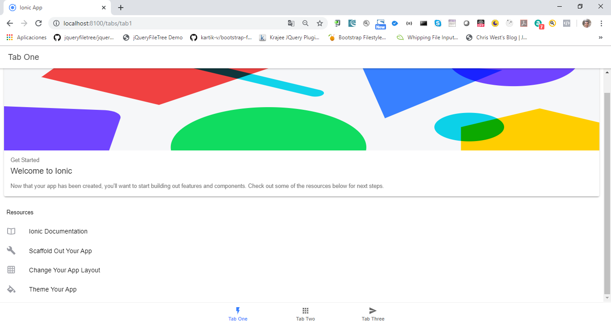

# Aplicación de peliculas                                                                           27 clases 03:17:07

## Introducción a la sección                                                                                     00:43

:+1:

## Temas puntuales de la sección                                                                                 00:12

En esta sección nos enfocaremos en trabajar creando una aplicación real que eventualmente desplegaremos en las AppStores, que se encargue de mostrar información de diversas películas actuales, uso de storage, consumo de APIS y mucho más.

El objetivo es reforzar conocimientos con las tareas y enfocarnos en un diseño más horizontal.

## Demostración de la aplicación - Peliculas                                                                     02:10

:+1:

## Inicio de proyecto - PeliculasApp                                                                             02:42

Creación del nuevo proyecto:

`ionic start peliculasApp tabs`

Cambiemonos a la carpeta del proyecto y levantemos el servidor:

`ionic serve`



Vamos a cambiar el nombre de los tabs en el archivo `tabs.page.html` por:

* Películas
* Buscar
* Favoritos

Así como el icono del 3er tab por `star-outline`.


## Creando un API Key en TheMovieDB                                                                              03:21

Vamos a utilizar la página [themoviedb](https://www.themoviedb.org/) 

"La base de datos de películas (TMDb) es una base de datos de películas y televisión creada por la comunidad. Todos los datos han sido agregados por nuestra increíble comunidad que se remonta a 2008. El fuerte enfoque internacional y la amplitud de datos de TMDb son en gran medida incomparables y algo de lo que estamos increíblemente orgullosos. En pocas palabras, vivimos y respiramos comunidad y eso es precisamente lo que nos hace diferentes."


### Registrarse en The Movie DB

Debemos registrarnos en The Movie DB


Una vez validado el email que nos envian podemos ingresar a nuestra cuenta:


Una vez adentro de nuestra cuenta ya podemos crear nuestro API Key, nos vamos a  `Perfil / Editar perfil / API`:


Pulsamos en `click here`:


Nos sale un texto que debemos Aceptar. Llegamos a un formulario que debemos rellenar.


Una vez rellenado el formulario nos genera nuestra **Clave de la API (v3 auth) 5cc470f991922e74ecfac8aaed7d9350** 


Podemos usar el URL [https://api.themoviedb.org/3/movie/550?api_key=5cc470f991922e74ecfac8aaed7d9350](https://api.themoviedb.org/3/movie/550?api_key=5cc470f991922e74ecfac8aaed7d9350) para recuperar el JSON.

También nos genera un **Token de acceso de lectura a la API (v4 auth)**

### The Movie Database (TMDb) API

En el siguiente enlace tenemos información completa sobre [The Movie Database (TMDb) API](https://developers.themoviedb.org/3/getting-started/introduction)

### Descubre Ejemplos del API

En el siguiente enlace podemos ver algunos [Ejemplos del API](https://www.themoviedb.org/documentation/api/discover)

## Servicio para traer las películas de estreno                                                                  08:31

Vamos a crear el primer servicio para recuperar información de **The Movie Database**, antes de esto vamos a ir a [Ejemplos del API](https://www.themoviedb.org/documentation/api/discover) y de allí vamos a copiar el primer URL:

 `/discover/movie?primary_release_date.gte=2014-09-15&primary_release_date.lte=2014-10-22`

 Este URL esta incompleto ya que le falta la primer parte que es:

 `https://api.themoviedb.org/3` la cual la podemos ver en [The Movie Database (TMDb) API](https://developers.themoviedb.org/3/getting-started/introduction).

 Por lo que el enlace completo es:

 `https://api.themoviedb.org/3/discover/movie?primary_release_date.gte=2014-09-15&primary_release_date.lte=2014-10-22`

 Este URL lo podemos probar en el navegador o en Postman:

 

 Este mensaje que nos regresa nos indica que no estamos facilitando el API Key, el API Key lo debemos mandar como un parámetro adicional:

 `https://api.themoviedb.org/3/discover/movie?primary_release_date.gte=2014-09-15&primary_release_date.lte=2014-10-22&api_key=5cc470f991922e74ecfac8aaed7d9350`


De esta manera nos regresa los datos correspondientes en un JSON, este enlace también lo podemos ejecutar en el navegador:


Podemos ver algunos de los resultados que nos regresa:

```js
"page": 1,
  "total_results": 2028,
  "total_pages": 102,
  "results": [
    {
      "popularity": 46.689,
      "vote_count": 11285,
      "video": false,
      "poster_path": "/5vHssUeVe25bMrof1HyaPyWgaP.jpg",
      "id": 245891,
      "adult": false,
      "backdrop_path": "/iJlGxN0p1suzloBGvvBu3QSSlhT.jpg",
      "original_language": "en",
      "original_title": "John Wick",
      "genre_ids": [
        28,
        53
      ],
      "title": "John Wick",
      "vote_average": 7.2,
      "overview": "Ex-hitman John Wick comes out of retirement to track down the gangsters that took everything from him.",
      "release_date": "2014-10-22"
    },
```

Podemos cambiar el valor de los parámetros para recuperar información más reciente ya que estabamos llamando información del 2014, cambiemosla:

`https://api.themoviedb.org/3/discover/movie?primary_release_date.gte=2019-11-01&primary_release_date.lte=2019-12-10&api_key=5cc470f991922e74ecfac8aaed7d9350`


Como podemos observar toda la información esta en inglés, podemos añadir un parámetro más para que la información nos la regrese en español:

`https://api.themoviedb.org/3/discover/movie?primary_release_date.gte=2019-11-01&primary_release_date.lte=2019-12-10&api_key=5cc470f991922e74ecfac8aaed7d9350&language=es`


Como podemos ver el texto de las descripciones entre otros ya se regresa en español. Otra opción que podemos tener es que las imagenes de las peliculas también se regresen en español añadiendo otro parámetro:

`https://api.themoviedb.org/3/discover/movie?primary_release_date.gte=2019-11-01&primary_release_date.lte=2019-12-10&api_key=5cc470f991922e74ecfac8aaed7d9350&language=es&include_image_language=es`

### Creación del Servicio

Vamos a crear el servicio para recuperar las películas llamado movies:

`ionic g s services/movies --skipTests=true`

Nos a creado el archivo `movies.service.ts` dentro de la carpeta `services`.

```js
import { Injectable } from '@angular/core';

@Injectable({
  providedIn: 'root'
})
export class MoviesService {

  constructor() { }
}
```

Como ya esta `providedIn: 'root'` no necesitaremos inyectar nada, pero para hacer peticiones **Http** necesitamos importar `HttpClientModule` algo en el `app.module.ts`:

```js
import { NgModule } from '@angular/core';
import { BrowserModule } from '@angular/platform-browser';
import { RouteReuseStrategy } from '@angular/router';

import { IonicModule, IonicRouteStrategy } from '@ionic/angular';
import { SplashScreen } from '@ionic-native/splash-screen/ngx';
import { StatusBar } from '@ionic-native/status-bar/ngx';

import { AppRoutingModule } from './app-routing.module';
import { AppComponent } from './app.component';

import { HttpClientModule } from '@angular/common/http';

@NgModule({
  declarations: [AppComponent],
  entryComponents: [],
  imports: [
    BrowserModule,
    IonicModule.forRoot(),
    AppRoutingModule,
    HttpClientModule
  ],
  providers: [
    StatusBar,
    SplashScreen,
    { provide: RouteReuseStrategy, useClass: IonicRouteStrategy }
  ],
  bootstrap: [AppComponent]
})
export class AppModule {}
```
Una vez que hemos iportado `HttpClientModule` podemos inyectarlo en el servicio para poder hacer la petición **Http**. Vamos a `movies.service.ts` para inyectar `HttpClient` lo tenemos que importar de `@angular/common/http` y crearemos el método `getFeature()` que recuperara la cartelera:

```js
import { Injectable } from '@angular/core';
import { HttpClient } from '@angular/common/http';

@Injectable({
  providedIn: 'root'
})
export class MoviesService {

  constructor(private http: HttpClient) { }

  getFeature(){
    return this.http.get('https://api.themoviedb.org/3/discover/movie?primary_release_date.gte=2019-11-01&primary_release_date.lte=2019-12-10&api_key=5cc470f991922e74ecfac8aaed7d9350&language=es&include_image_language=es');
  }
}
```
Vamos a probar este servicio. En `tab1.page.ts` que es la página principal inyectaremos dicho servicio e implementaremos el `OnInit()` donde llamaremos el servicio para ver si funciona:

```js
import { MoviesService } from '../services/movies.service';
import { Component, OnInit } from '@angular/core';

@Component({
  selector: 'app-tab1',
  templateUrl: 'tab1.page.html',
  styleUrls: ['tab1.page.scss']
})
export class Tab1Page implements OnInit{

  constructor( private moviesService: MoviesService) {}

  ngOnInit() {
    this.moviesService.getFeature()
    .subscribe( console.log );
  }
}
```

Si ejecutamos la aplicación al cargar el Tab Películas vemos como se recupera el JSON con las películas;


## Crear la interfaz de la respuesta y películas                                                                 04:18

Vamos a crear una **Interfaz** para manejar de una manera más sencilla los resultados que regresa el Servicio creado en la sección anterior, en nuestro archivo `tab1.page.ts` donde invocamos el servicio, tenemos:

```js
export class Tab1Page implements OnInit{

  constructor( private moviesService: MoviesService) {}

  ngOnInit() {
    this.moviesService.getFeature()
    .subscribe( console.log );
  }
}
```

Lo modificamos por esto:

```js
ngOnInit() {
  this.moviesService.getFeature()
  .subscribe( resp => {
    console.log('Resp', resp);
  });
}
```


Obtenemos el mismo resultado pero con la palabra **Resp** previamente. 

### General la interfaz basadonos en el JSON

Para generar la interfaz a partir de un JSON podemos seguir los siguientes pasos:

* Tener instalada la Extensión JSON to TS
* En la carpeta APP creamos una carpeta llamada **interfaces**
* Creamos el archivo `interfaces.ts`
* Tomando el URL lo cargamos en el navegador:
   `https://api.themoviedb.org/3/discover/movie?primary_release_date.gte=2019-11-01&primary_release_date.lte=2019-12-10&api_key=5cc470f991922e74ecfac8aaed7d9350&language=es&include_image_language=es`
* Copiamos el JSON entero que nos regresa con Ctrl+C
* En el archivo `interfaces.ts` vamos a llamar el Pluging `JSON to TS from clipboard` o usar **Convert from clipboard** (`Ctrl + Alt + V`)

Al hacer todo esto en el archivo `interfaces.ts` se generan dos interfaces basados en el JSON:

```js
interface RootObject {
  page: number;
  total_results: number;
  total_pages: number;
  results: Result[];
}

interface Result {
  popularity: number;
  vote_count: number;
  video: boolean;
  poster_path: string;
  id: number;
  adult: boolean;
  backdrop_path?: string;
  original_language: string;
  original_title: string;
  genre_ids: number[];
  title: string;
  vote_average: number;
  overview: string;
  release_date: string;
}
```

Para que estas dos interfaces puedan ser usadas desde fuera necesitan ser exportables, ademas vamos a cambiarles el nombre para que refrejen lo que representan, por lo que el elcódigo final queda así:

```js
export interface RespuestaMDB {
  page: number;
  total_results: number;
  total_pages: number;
  results: Pelicula[];
}

export interface Pelicula {
  popularity: number;
  vote_count: number;
  video: boolean;
  poster_path: string;
  id: number;
  adult: boolean;
  backdrop_path?: string;
  original_language: string;
  original_title: string;
  genre_ids: number[];
  title: string;
  vote_average: number;
  overview: string;
  release_date: string;
}
```

Ahora que ya tenemos definidas las Interfaces, volvamos a `tab1.page.ts` donde podemos poner el tipo `RespuestaMBD` a **resp** y crearemos el atributo `peliculasRecientes` que será un array que contenga toda la lista de películas, nuestro código final queda así:

```js
import { RespuestaMDB, Pelicula } from './../interfaces/interfaces';
import { MoviesService } from '../services/movies.service';
import { Component, OnInit } from '@angular/core';

@Component({
  selector: 'app-tab1',
  templateUrl: 'tab1.page.html',
  styleUrls: ['tab1.page.scss']
})
export class Tab1Page implements OnInit{

  peliculasRecientes: Pelicula[] = [];

  constructor( private moviesService: MoviesService) {}

  ngOnInit() {
    this.moviesService.getFeature()
    .subscribe( (resp: RespuestaMDB) => {
      console.log('Resp', resp);
      this.peliculasRecientes = resp.results;
    });
  }
}
```

Todo debe seguir funcionando igual que antes:


Lo único que ya podremos saber exactamente que datos nos regresa el JSON, facilitando su uso.

Si vamos al servicio podemos mandarle explicitamente el tipo de dato que regresa el servicio poniendo `<RespuestaMDB>`:

```js
getFeature() {
    // tslint:disable-next-line:max-line-length
    return this.http.get<RespuestaMDB>('https://api.themoviedb.org/3/discover/movie?primary_release_date.gte=2019-11-01&primary_release_date.lte=2019-12-10&api_key=5cc470f991922e74ecfac8aaed7d9350&language=es&include_image_language=es');
  }
```

Haciendo esto podemos ir a `tab1.page.ts` que tiene:

```js
ngOnInit() {
  this.moviesService.getFeature()
  .subscribe( (resp: RespuestaMDB) => {
    console.log('Resp', resp);
    this.peliculasRecientes = resp.results;
  });
}
```
Y podemos quitar el tipado de aquí, por que ya se manda explicitamente desde el servicio. Por lo que el código puede quedar así:

```js
ngOnInit() {
  this.moviesService.getFeature()
  .subscribe( resp => {
    console.log('Resp', resp);
    this.peliculasRecientes = resp.results;
  });
}
```

## Mostrar películas - pipe.module y pipe imagen                                                                 10:56

Vamos a empezar a mostrar información en nuestra pantalla principal que es `tab1.page.html`, empecemos por borrar todo lo que tiene, incluso el `header` ya que esta aplicación no los usara.

Sustituyamoslo por:

```js
<ion-content>
    <ion-slides>
      <ion-slide *ngFor="let pelicula of peliculasRecientes">
        <h1>{{ pelicula.title }}</h1>
      </ion-slide>
    </ion-slides>
</ion-content>
```
Tenemos un Slides que muestra el título de la película en un Slide, si nos desplazamos hacia los lados va mostrando los siguientes títulos, hasta llegar a la película 20 que es la última para la primer página:


Podriamos pintar las imagenes en lugar de los títulos, el JSON nos regresa dos imagenes diferentes, `poster_path` y `backdrop_path`:

```js
"poster_path": "/jnFCk7qGGWop2DgfnJXeKLZFuBq.jpg",
"backdrop_path": "/xJWPZIYOEFIjZpBL7SVBGnzRYXp.jpg",
```

Como podemos observar son URLs incompleto, si nos vamos a la [documentación de Imagenes en The Movie DB](https://developers.themoviedb.org/3/getting-started/images), tenemos un ejemplo de un URL completo:

`https://image.tmdb.org/t/p/w500/kqjL17yufvn9OVLyXYpvtyrFfak.jpg`

El cual corresponde a una imagen de la película de MadMax:


Por lo que para completar los URLs de las dos imagenes que regresa el JSON tenemos que añadirles `https://image.tmdb.org/t/p/w500` es decir los dos URLs completos son:

```js
"poster_path": "https://image.tmdb.org/t/p/w500/jnFCk7qGGWop2DgfnJXeKLZFuBq.jpg",
"backdrop_path": "https://image.tmdb.org/t/p/w500/xJWPZIYOEFIjZpBL7SVBGnzRYXp.jpg",
```


Por lo que en nuestro código usaremos `poster_path` añadiendo `https://image.tmdb.org/t/p/w500` previamente. Esto lo podemos hacer usando `pipes`, como puede ser que usemos varios, crearemos un modulo que maneje todos los `pipes`.

### Creación del Modulo pipes 

Para crear el modulo usamos el comando:

`ionic g m pipes`

Nos indica:

`CREATE src/app/pipes/pipes.module.ts (191 bytes)`

Es decir que crea una carpeta `pipes` y dentro el archivo `pipes.module.ts`.

### Creación del pipe imagen

El siguiente paso es crear un `pipe` que llamaremos `imagen` usando el comando:

`ionic g pipe pipes/imagen --skipTests=true`

Nos indica:

```js
CREATE src/app/pipes/imagen.pipe.ts (205 bytes)
UPDATE src/app/pipes/pipes.module.ts (245 bytes)
```

Se crea el archivo `imagen.pipe.ts` y se actualiza `pipes.module.ts`. 

Vamos a `pipes.module.ts`

```js
import { NgModule } from '@angular/core';
import { CommonModule } from '@angular/common';
import { ImagenPipe } from './imagen.pipe';

@NgModule({
  declarations: [
    ImagenPipe
  ],
  imports: [
    CommonModule
  ]
})
export class PipesModule { }
```

Aquí se ha importado y declarado `ImagenPipe`, pero como es algo que usaremos fuera del modulo tenemos que decirle que será exportable con:

```js
exports: [
  ImagenPipe
],
```

### Lógica en el pipe

Vamos al archivo `imagen.pipe.ts` que es donde debemos trabajar nuestra lógica para que la imagen tenga el URL completo.

```js
import { Pipe, PipeTransform } from '@angular/core';

@Pipe({
  name: 'imagen'
})
export class ImagenPipe implements PipeTransform {

  transform(value: any, ...args: any[]): any {
    return null;
  }

}
```

Una vez implementada la lógica en el `pipe imagen` el código nos queda así:

```js
import { Pipe, PipeTransform } from '@angular/core';
// Ruta completa de la imágen
// https://image.tmdb.org/t/p/w500/kqjL17yufvn9OVLyXYpvtyrFfak.jpg
const URL = 'https://image.tmdb.org/t/p';

@Pipe({
  name: 'imagen'
})
export class ImagenPipe implements PipeTransform {

  transform( img: string, size: string = 'w500'): string {

    // Pregunto si existe una imágen
    if ( !img ) {
      return;
    }

    const imgUrl = `${ URL }/${ size }${ img }`;
    console.log('URL', imgUrl );

    return imgUrl;
  }
}
```

### Como utilizar el pipe imagen

Lo primero que debemos hacer es importar el `pipes.module.ts` en `tab1.module.ts`:

```js
import { PipesModule } from '../pipes/pipes.module';

@NgModule({
  imports: [
    IonicModule,
    CommonModule,
    FormsModule,
    PipesModule,
    RouterModule.forChild([{ path: '', component: Tab1Page }])
  ],
  declarations: [Tab1Page]
})
export class Tab1PageModule {}
```
Vamos a `tab1.module.html` para hacer que nos pinte la imagen usando nuestro pipe, el código necesario es:

```js
<ion-content>
  <ion-slides>
    <ion-slide *ngFor="let pelicula of peliculasRecientes">
      <ion-card>
        
      </ion-card>
    </ion-slide>
  </ion-slides>
</ion-content>
```
Al cargar la página observamos como ya se muestra una imágen, y como en el `imagen.pipe.ts` hemos puesto un `console.log('URL', imgUrl );` vemos en consola todas las rutas de las imagenes:


Como se puede ver también en la consola hay algunas imagenes que no existen:


La mayoria de las imagenes si existe por lo que nos desplazamos a las siguiente película arrastrando la pantalla lateralmente, tendriamos algo así:


Lo unico malo de este diseño es que no es muy intuitivo para el usuario saber que se debe desplazar lateralmente para ver otras películas. Vamos a cambiar un poco nuestros `slides` poniendo algunas opciones.

Vamos a `tab1.page.html` y añadamos las opciones:

```js
<ion-content>
  <ion-slides [options]="slideOpts">
    <ion-slide *ngFor="let pelicula of peliculasRecientes">
      <ion-card>
        
      </ion-card>
    </ion-slide>
  </ion-slides>
</ion-content>
```

Debemos definir `slideOpts` en `tab1.page.ts`:

```js
slideOpts = {
  slidesPerView: 1.2,
  freeMode: true
};
```

Al hacer estos pequeños cambios la interface es más intuitiva para el usuario, de esta manera sabra que se puede desplazarse lateralmente para ver más películas:


Como podemos apreciar existe un problema cuando el JSON no regresa una imágen, por lo que en ese caso pintaremos la imagen `no-image-banner.jpg` en ese caso:


Esta imagen la debemos insertar en la carpeta `assets`.

Por lo que en el `pipe imagen.pipe.ts` en caso de que no exista imagen regresaremos la imagen `no-image-banner.jpg`:

```js
import { Pipe, PipeTransform } from '@angular/core';
// Ruta completa de la imágen
// https://image.tmdb.org/t/p/w500/kqjL17yufvn9OVLyXYpvtyrFfak.jpg
const URL = 'https://image.tmdb.org/t/p';

@Pipe({
  name: 'imagen'
})
export class ImagenPipe implements PipeTransform {

  transform( img: string, size: string = 'w500'): string {

    // Pregunto si existe una imágen
    if ( !img ) {
      return './assets/no-image-banner.jpg';
    }

    const imgUrl = `${ URL }/${ size }${ img }`;
    console.log('URL', imgUrl );

    return imgUrl;
  }
}
```

Con esta solución ya no se rompe la aplicación, se ve una imagen en caso de no existir:


## Variables globales de nuestra aplicación                                                                      10:24

Vamos a optimizar un poco nuestra aplicacion, entre otras cosas para no tener las URLs por todos lados lo que complica el mantenimiento.

Contamos con la carpeta `environments` con dos archivos:

* `environment.prod.ts` para producción.
* `environment.ts` para desarrollo local.

En estos archivos podemos definir variables que podemos usar de manera global en nuestra aplicación.

Vamos a abrir el archivo `environment.ts` y definir tres variables:

* url
* apiKey
* imgPath

```js
export const environment = {
  production: false,
  url: 'https://api.themoviedb.org/3',
  apiKey: '5cc470f991922e74ecfac8aaed7d9350',
  imgPath: 'https://image.tmdb.org/t/p'
};
```

Esto mismo lo copiaremos en el archivo `environment.prod.ts`, podría ser que para producción se usaran otros servidores por eso se tienen dos archivos diferentes pero en este caso se usara lo mismo.

Los dos primeros los usamos en `movies.service.ts` y el tercero en `imagen.pipe.ts`. Por lo que vamos a sustituir en `imagen.pipe.ts` 
esto: 

`const URL = 'https://image.tmdb.org/t/p';``

Por esto:

`const URL = environment.imgPath;`

Demos importarlo del archivo de propiedades locales y no del de producción:

`import { environment } from './../../environments/environment';`

Ahora vamos a cambiar el servicio `movies.service.ts`, este archivo necesita más ajustes por que la URL usada tiene varios parámetros, el código actual es:

```js
import { RespuestaMDB } from './../interfaces/interfaces';
import { Injectable } from '@angular/core';
import { HttpClient } from '@angular/common/http';

@Injectable({
  providedIn: 'root'
})
export class MoviesService {

  constructor(private http: HttpClient) { }

  getFeature() {
    // tslint:disable-next-line:max-line-length
    return this.http.get<RespuestaMDB>('https://api.themoviedb.org/3/discover/movie?primary_release_date.gte=2019-11-01&primary_release_date.lte=2019-12-10&api_key=5cc470f991922e74ecfac8aaed7d9350&language=es&include_image_language=es');
  }
}
```

El código modificado queda así:

```js
import { environment } from './../../environments/environment';
import { RespuestaMDB } from './../interfaces/interfaces';
import { Injectable } from '@angular/core';
import { HttpClient } from '@angular/common/http';

const URL    = environment.url;
const apiKey = environment.apiKey;

@Injectable({
  providedIn: 'root'
})
export class MoviesService {

  constructor(private http: HttpClient) { }

  private ejecutarQuery<T>( query: string ){

    query = URL + query;
    query += `&api_key=${ apiKey }&language=es&include_image_language=es`;

    return this.http.get<T>( query );
  }

  getFeature() {
    // tslint:disable-next-line:max-line-length
    return this.ejecutarQuery<RespuestaMDB>('/discover/movie?primary_release_date.gte=2019-11-01&primary_release_date.lte=2019-12-10');
  }
}
```

Con los cambios hechos hasta aquí nuestra aplicación sigue trabajando exactamente igual:


Hay una cosa que aun podemos optimizar y esto son las fechas que se le mandan ya que ahora mismo las estamos poniendo "harcodeadas", vamos a obtenerlas con JavaScript, el código modificado nos queda así:

```js
import { environment } from './../../environments/environment';
import { RespuestaMDB } from './../interfaces/interfaces';
import { Injectable } from '@angular/core';
import { HttpClient } from '@angular/common/http';

const URL    = environment.url;
const apiKey = environment.apiKey;

@Injectable({
  providedIn: 'root'
})
export class MoviesService {

  constructor(private http: HttpClient) { }

  private ejecutarQuery<T>( query: string ){

    query = URL + query;
    query += `&api_key=${ apiKey }&language=es&include_image_language=es`;

    return this.http.get<T>( query );
  }

  getFeature() {

    const hoy = new Date();
    const ultimoDia = new Date( hoy.getFullYear(), hoy.getMonth() + 1, 0).getDate();
    const mes = hoy.getMonth() + 1;

    let mesString;

    if( mes < 10 ){
      mesString = '0' + mes;
    }else{
      mesString = mes;
    }

    const inicio = `${ hoy.getFullYear() }-${ mesString }-01`;
    const fin    = `${ hoy.getFullYear() }-${ mesString }-${ ultimoDia }`;

    // tslint:disable-next-line:max-line-length
    return this.ejecutarQuery<RespuestaMDB>(`/discover/movie?primary_release_date.gte=${ inicio }&primary_release_date.lte=${ fin }`);
  }
}
```

Como ya estamos recuperando los datos con otras fechas dinámicas lo obtenido ha cambiado pero todo sigue trabajando igual:


## Componente SlideShow y componente SlideShow-Poster                                                            12:20

En esta sección vamos a crear dos componentes el primero de ellos `SlideShow` nos servira para tener un componente que nos haga lo que actualmente se hase en el `tab1`, la ventaja de tenerlo como componente es que si necesitamos usar algo parecido solo insertamos el componente en nuestra página y listo, actualmente no lo podriamos hacer, tendriamos que coner todo el código.

Antes de hacer esto vamos a meter un título previo al Slider, en `tab1.page.html` usando el componente `ion-grid`:

```js
<ion-grid fixed>
  <ion-row>
    <ion-col>
      <h3>Películas Nuevas</h3>
    </ion-col>
  </ion-row>
</ion-grid>
```


### Crear el componente SlideShow

Ahora voy a crearme un componente para almacenar aquí todo el Slide,recibirá como argumento las `películasRecientes`. A este componente le mandaré mi arreglo de películas que quiero desplegar y trabajará de esa manera.

Necesito un módulo de componentes primero para agruparlos todos, lo crearemos con:

`ionic g m components`

Nos indica:

`CREATE src/app/components/components.module.ts`

Ahora vamos a crear el primer componente:

`ionic g c components/slideshow-backdrop`

De esa manera queda bastante claro que es el componente va a crear Slides de tipo de backdrop (como la imágen).

Nos indica:

```js
CREATE src/app/components/slideshow-backdrop/slideshow-backdrop.component.html (37 bytes)
CREATE src/app/components/slideshow-backdrop/slideshow-backdrop.component.spec.ts (760 bytes)
CREATE src/app/components/slideshow-backdrop/slideshow-backdrop.component.ts (315 bytes)
CREATE src/app/components/slideshow-backdrop/slideshow-backdrop.component.scss (0 bytes)
```
(Debería haber actualizado el archivo `components.module,ts` pero no lo hizo). Por lo que he tenido actualizar manualmente el código es:

```js
import { NgModule } from '@angular/core';
import { CommonModule } from '@angular/common';
import { SlideshowBackdropComponent } from './slideshow-backdrop/slideshow-backdrop.component';


@NgModule({
  declarations: [SlideshowBackdropComponent],
  imports: [
    CommonModule
  ]
})
export class ComponentsModule { }
```

Voy a tomar el código del Slide que tengo en `tab1.page.html` y lo transladamos a `slideshow-backdrop.component.html`:

```js
<ion-slides [options]="slideOpts">
  <ion-slide *ngFor="let pelicula of peliculasRecientes">
    <ion-card>
      
    </ion-card>
  </ion-slide>
</ion-slides>
```
Si cargamos la página ya no vemos las imagenes:


Pero no nos marca ningun error. 

En `components.module,ts` es necesario importar el `IonicModule` para poder utilizar todos los componentes de Ionic dentro de los componentes del modulo, también debemos importar nuestro `PipeModule` para usar el pipe `imagen`. También es necesario exportar el componente `SlideshowBackdropComponent` por que será utilizado fuera de este modulo. Nuestro código final de `components.module,ts` queda así:

```js
import { NgModule } from '@angular/core';
import { CommonModule } from '@angular/common';
import { SlideshowBackdropComponent } from './slideshow-backdrop/slideshow-backdrop.component';
import { IonicModule } from '@ionic/angular';
import { PipesModule } from '../pipes/pipes.module';


@NgModule({
  declarations: [
    SlideshowBackdropComponent
  ],
  exports: [
    SlideshowBackdropComponent
  ],
  imports: [
    CommonModule,
    IonicModule,
    PipesModule
  ]
})
export class ComponentsModule { }
```

En `slideshow-backdrop.component.html` estamos utilizando `peliculasRecientes` (lo cambiaremos por `peliculas`) pero este parámetro no lo estamos recibiendo en ningún lado, por eso no se pinta nada. Por lo que es necesario recibirlo en `slideshow-backdrop.component.ts` usando `@Input`:

`@Input() peliculas: Pelicula[] = [];`

También tenemos que incluir la variable `slideOpts` las quitamos de `tab1.page.ts` y las ponemos en `slideshow-backdrop.component.ts`.

El código final queda así:

```js
import { Component, OnInit, Input } from '@angular/core';
import { Pelicula } from '../../interfaces/interfaces'

@Component({
  selector: 'app-slideshow-backdrop',
  templateUrl: './slideshow-backdrop.component.html',
  styleUrls: ['./slideshow-backdrop.component.scss'],
})
export class SlideshowBackdropComponent implements OnInit {

  @Input() peliculas: Pelicula[] = [];

  slideOpts = {
    slidesPerView: 1.2,
    freeMode: true
  };

  constructor() { }

  ngOnInit() {}

}
```

Ya hemos incluido todo lo que necesita nuestro componente. El siguiente paso es usar ese componente en `tab1.page.html`, pero para poderlo usar el componente que esta incluido en el modulo `ComponentsModule`, debemos importar dicho modulo en `tab.module.ts`:

```js
import { IonicModule } from '@ionic/angular';
import { RouterModule } from '@angular/router';
import { NgModule } from '@angular/core';
import { CommonModule } from '@angular/common';
import { FormsModule } from '@angular/forms';
import { Tab1Page } from './tab1.page';
import { PipesModule } from '../pipes/pipes.module';
import { ComponentsModule } from '../components/components.module';

@NgModule({
  imports: [
    IonicModule,
    CommonModule,
    FormsModule,
    PipesModule,
    ComponentsModule,
    RouterModule.forChild([{ path: '', component: Tab1Page }])
  ],
  declarations: [Tab1Page]
})
export class Tab1PageModule {}
```
Haciendo lo anterior ya podemos ir a `tab1.pages.html` e incluir nuestro componente, lo hacemos de la siguiente forma:

```js
<app-slideshow-backdrop [peliculas]="peliculasRecientes"></app-slideshow-backdrop>
```

Entre corchetes ponemos el nombre de la propiedad `@Input() peliculas: Pelicula[] = [];` que definimos en `slideshow-backdrop.component.ts`, y lo igualamos a `peliculasRecientes` que es el array donde tenemos la lista de nuestras películas. 

Vamos a probarlo deberíamos verlo igual.


Efectivamente todo se ve igual. ¿Entonces para que todo ese cambio? ¿Que hemos ganado?

La respuesta es sencilla, podriamos usar ese componente en cualquier lado que quisieramos pintar otro arreglo diferente de películas, en este caso vamos a usarlo nuevamente en `tab.page.html` para ver su uso:

```js
<ion-content>
  <ion-grid fixed>
    <ion-row>
      <ion-col>
        <h3>Películas Nuevas</h3>
      </ion-col>
    </ion-row>
  </ion-grid>
  <app-slideshow-backdrop [peliculas]="peliculasRecientes"></app-slideshow-backdrop>
  <app-slideshow-backdrop [peliculas]="peliculasRecientes"></app-slideshow-backdrop>
</ion-content>
```


### Tarea 

Ahora sí vamos con la tarea preste mucha atención.

1. Hay que crear un componente llamado SlideShow-Poster

`ionic g c components/slideshowPoster --skipTests=true`

Nos indica:

```
CREATE src/app/components/slideshow-poster/slideshow-poster.component.html (35 bytes)
CREATE src/app/components/slideshow-poster/slideshow-poster.component.spec.ts (746 bytes)
CREATE src/app/components/slideshow-poster/slideshow-poster.component.ts (307 bytes)
CREATE src/app/components/slideshow-poster/slideshow-poster.component.scss (0 bytes)
```

Nuevamente no a actualizado `components.module.ts` así que lo hare manualmente:

```js
import { NgModule } from '@angular/core';
import { CommonModule } from '@angular/common';
import { SlideshowBackdropComponent } from './slideshow-backdrop/slideshow-backdrop.component';
import { SlideshowPosterComponent } from './slideshow-poster/slideshow-poster.component';
import { IonicModule } from '@ionic/angular';
import { PipesModule } from '../pipes/pipes.module';


@NgModule({
  declarations: [
    SlideshowBackdropComponent,
    SlideshowPosterComponent
  ],
  exports: [
    SlideshowBackdropComponent,
    SlideshowPosterComponent
  ],
  imports: [
    CommonModule,
    IonicModule,
    PipesModule
  ]
})
export class ComponentsModule { }
```
2. Crear un Slideshow utilizando el poster_path

En el archivo `slideshow-poster.component.ts` metemos el siguiente código:

```js
import { Component, OnInit, Input } from '@angular/core';
import { Pelicula } from '../../interfaces/interfaces';

@Component({
  selector: 'app-slideshow-poster',
  templateUrl: './slideshow-poster.component.html',
  styleUrls: ['./slideshow-poster.component.scss'],
})
export class SlideshowPosterComponent implements OnInit {

  @Input() peliculas: Pelicula[] = [];

  slideOpts = {
    slidesPerView: 3.3,
    freeMode: true
  };

  constructor() { }

  ngOnInit() {}

}
```

Y en el archivo `slideshow-poster.component.html` tenemos:

```js
<ion-slides [options]="slideOpts">
  <ion-slide *ngFor="let pelicula of peliculas">
    <ion-card> 
      
    </ion-card>
  </ion-slide>
</ion-slides>
```
Aquí usamos la clase `poster` que insertaremos en `global.scss`.

3. Crear una clase en `global.scss` para que los poster no salgan muy grandes.

```css
.poster{
  width: 110px !important;
  height: 160px !important;
}
```

4. Meter el componente en `tab1.pages.html` en lugar del duplicado que tenemos, el código final es:

```js
<ion-content>

  <ion-grid fixed>
    <ion-row>
      <ion-col>
        <h3>Películas Nuevas</h3>
      </ion-col>
    </ion-row>
  </ion-grid>

  <app-slideshow-backdrop [peliculas]="peliculasRecientes"></app-slideshow-backdrop>

  <ion-grid fixed>
    <ion-row>
      <ion-col>
        <h3>Cartelera</h3>
      </ion-col>
    </ion-row>
  </ion-grid>

  <app-slideshow-poster [peliculas]="peliculasRecientes"></app-slideshow-poster>

</ion-content>
```

Al cargar la página tenemos:


## Mostrar películas populares                                                                                   04:36

Ahora vamos a crearnos un arreglo especial de las películas populares.

Para eso necesito llamar un nuevo servicio.

Nos vamos a la documentación de **The Movie Database API** el enlace directo a [Discover](https://developers.themoviedb.org/3/discover/movie-discover) y aquí tienen un servicio que me permite traer las películas ordenadas por popularidad con el parámetro `sort_by`, nosotros la queremos descendente.


Entonces implementemos esto en nuestra aplicación.

Hay que crear un nuevo servicio o un nuevo método en mi servicio. Este método se llamará `getPopulares` dentro del archivo `movies.service.ts`:

```js
getPopulares() {
  const query = '/discover/movie?sort_by=popularity.desc';

  return this.ejecutarQuery<RespuestaMDB>(query);
}
```
Ya que tenemos nuestro servicio, vamos a `tab1.page.ts` para utilizarlo. Declararemos la propiedad `peliculasPopulares` que almacenara el array de películas populares. Y en `ngOnInit()` invocaremos al método del servicio `getPopulares()`:

```js
import { Pelicula } from './../interfaces/interfaces';
import { MoviesService } from '../services/movies.service';
import { Component, OnInit } from '@angular/core';

@Component({
  selector: 'app-tab1',
  templateUrl: 'tab1.page.html',
  styleUrls: ['tab1.page.scss']
})
export class Tab1Page implements OnInit{

  peliculasRecientes: Pelicula[] = [];
  peliculasPopulares: Pelicula[] = [];

  constructor( private moviesService: MoviesService) {}

  ngOnInit() {
    this.moviesService.getFeature()
      .subscribe( resp => {
        //console.log('Resp', resp);
        this.peliculasRecientes = resp.results;
      });

    this.moviesService.getPopulares()
      .subscribe( resp => {
        console.log('Populares: ', resp );
        this.peliculasPopulare = resp.results;
      });
  }
}
```

Si cargamos la página por lo menos el mensaje en consola de las películas populares es lo que veremos.


Las voy a mostrar con el mismo componente de las películas, después lo modificaremos para que muestre de dos en dos.

Vamos de regreso a `tab1.page.html` meteremos el título para peliculas populares y usaremos el componte para que las pinte:

```js

<ion-content>

  <ion-grid fixed>
    <ion-row>
      <ion-col>
        <h3>Películas Nuevas</h3>
      </ion-col>
    </ion-row>
  </ion-grid>

  <app-slideshow-backdrop [peliculas]="peliculasRecientes"></app-slideshow-backdrop>

  <ion-grid fixed>
    <ion-row>
      <ion-col>
        <h3>Cartelera</h3>
      </ion-col>
    </ion-row>
  </ion-grid>

  <app-slideshow-poster [peliculas]="peliculasRecientes"></app-slideshow-poster>

  <ion-grid fixed>
    <ion-row>
      <ion-col>
        <h3>Películas Populares</h3>
      </ion-col>
    </ion-row>
  </ion-grid>

  <app-slideshow-poster [peliculas]="peliculasPopulares"></app-slideshow-poster>

</ion-content>
```


Se mira bien pero aquí quiero hacer algo diferente quiero que estas películas populares se carguen de dos en dos es decir que en vez de tener que hacer tanto scroll para llegar a las siguientes quiero que aparezcan en columnas de dos.

## Mostrar pares de películas                                                                                    07:58
## Cargar más películas horizontalmente                                                                          11:44
## Modal con los detalles de la película                                                                         08:04
## Información de la película y actores                                                                          09:27
## Mostrar detalles de la película                                                                               10:44
## Mostrar detalles de la película - Parte 2                                                                     13:21
## Diseño de la página de búsqueda de películas                                                                  08:04
## Servicio para buscar películas                                                                                04:24
## Diseño de la página de búsqueda de películas                                                                  11:05
## Guardar películas en el storage                                                                               06:32
## Prevenir duplicados en nuestro storage de películas                                                           04:54
## Cargar favoritos del storage y verificar si existe una película por ID                                        12:24
## Mostrar pantalla de favoritos                                                                                 12:49
## Tarea: Favoritos por género                                                                                   10:18
## Pequeños arreglos estéticos en ios                                                                            04:48
## Código fuente de la sección                                                                                   00:18